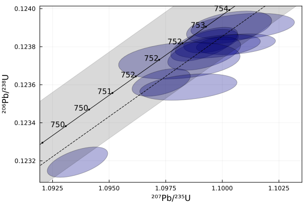
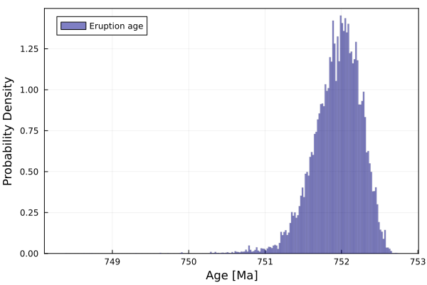
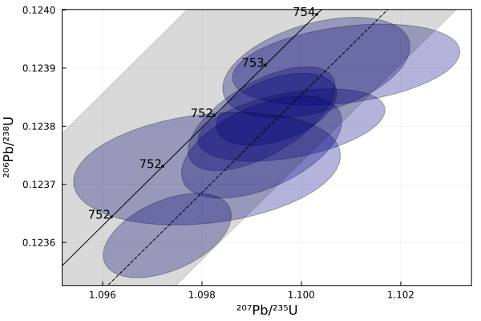
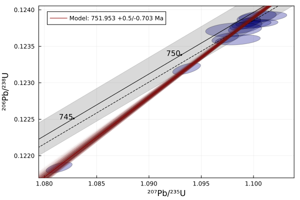

# Isoplot.jl
[![Docs][docs-dev-img]][docs-dev-url]
[![CI][ci-img]][ci-url]
[![codecov.io][codecov-img]][codecov-url]

Well someone needs to write one...

## Installation
```Julia
pkg> add Isoplot
```

## Usage

```julia
using Isoplot, Plots

# Example U-Pb dataset (MacLennan et al. 2020)
#       207/235  1σ abs   206/236     1σ abs     correlation
data = [1.1009 0.00093576 0.123906 0.00002849838 0.319
        1.1003 0.00077021 0.123901 0.00003531178 0.415
        1.0995 0.00049477 0.123829 0.00002538494 0.434
        1.0992 0.00060456 0.123813 0.00003652483 0.616
        1.1006 0.00071539 0.123813 0.00002228634 0.321
        1.0998 0.00076986 0.123802 0.00002537941 0.418
        1.0992 0.00065952 0.123764 0.00003589156 0.509
        1.0981 0.00109810 0.123727 0.00003959264 0.232
        1.0973 0.00052670 0.123612 0.00002966688 0.470
        1.0985 0.00087880 0.123588 0.00002842524 0.341
        1.0936 0.00054680 0.123193 0.00003264614 0.575
        1.0814 0.00051366 0.121838 0.00003045950 0.587 ]

# Turn into UPbAnalysis objects
analyses = UPbAnalysis.(eachcol(data)...,)
# Screen for discordance
analyses = analyses[discordance.(analyses) .< 0.2]

# Plot in Wetherill concordia space
hdl = plot(xlabel="²⁰⁷Pb/²³⁵U", ylabel="²⁰⁶Pb/²³⁸U", framestyle=:box)
plot!(hdl, analyses, color=:darkblue, alpha=0.3, label = "")
concordiacurve!(hdl) # Add concordia curve
savefig(hdl, "concordia.svg")
display(hdl)
```



### Pb-loss-aware Bayesian eruption age estimation
```julia
nsteps = 10^6
tmindist, t0dist = metropolis_min(nsteps, HalfNormalDistribution, analyses; burnin=10^4)

terupt = CI(tmindist)
println("Eruption/deposition age: $terupt Ma (95% CI)")
```
> Eruption/deposition age: 751.942 +0.504/-0.709 Ma (95% CI)

```julia
h = histogram(tmindist, xlabel="Age [Ma]", ylabel="Probability Density", normalize=true, label="Eruption age", color=:darkblue, alpha=0.65, linealpha=0.1, framestyle=:box)
ylims!(h, 0, last(ylims()))
savefig(h, "EruptionAge.svg")
display(h)
```


```julia
h = histogram(t0dist, xlabel="Age [Ma]", ylabel="Probability Density", normalize=true, label="Time of Pb-loss", color=:darkblue, alpha=0.65, linealpha=0.1, framestyle=:box)
xlims!(h, 0, last(xlims()))
ylims!(h, 0, last(ylims()))
savefig(h, "PbLoss.svg")
display(h)
```


Notably, In contrast to a weighted mean or a standard Bayesian eruption age, the result appears to be influenced little if at all by any decision to exclude or not exclude discordant grains, for example:

Excluding several most discordant grains


> Eruption/deposition age: 751.946 +0.508/-0.765 Ma (95% CI)

Excluding nothing


> Eruption/deposition age: 751.951 +0.501/-0.695 Ma (95% CI)

indicating perhaps only a slight _increase_ in precision when more data are included, even if those data happen to be highly discordant.

[docs-dev-img]: https://img.shields.io/badge/docs-dev-blue.svg
[docs-dev-url]: https://JuliaGeochronology.github.io/Isoplot.jl/dev/
[ci-img]: https://github.com/JuliaGeochronology/Isoplot.jl/workflows/CI/badge.svg
[ci-url]: https://github.com/JuliaGeochronology/Isoplot.jl/actions/workflows/CI.yml
[codecov-img]: http://codecov.io/github/JuliaGeochronology/Isoplot.jl/coverage.svg?branch=main
[codecov-url]: http://codecov.io/github/JuliaGeochronology/Isoplot.jl?branch=main
